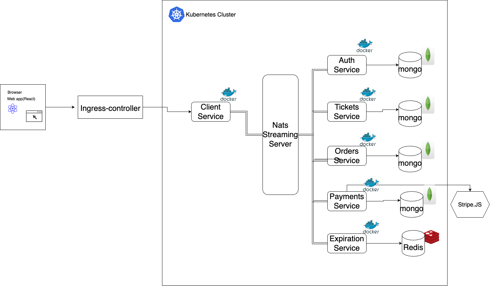

# Ticketing Web Application (Microservices) 

<!-- TABLE OF CONTENTS -->
## Table of Contents
* [About the App](#about-the-app)
  * [Built With](#built-with)
  * [Features](#features)
* [Getting Started](#getting-started)
  * [Prerequisites](#prerequisites)
  * [Run the app](#run-the-app)
* [Architecture](#architecture)
  * [Services](#services)
  * [Event-driven](#event-driven)
* [Technical Stacks](#architecture)
  * [Frontend](#services)
  * [Backend](#event-driven)
  * [Database](#architecture)
  * [Build And Deploy](#build-and-deploy)

<!-- ABOUT THE APP -->
## About The App
A ticket exchange and resale application, enabling buyers and resellers to register, log in, purchase tickets using credit cards, and list tickets for resale.

### Features
* Authentication
* Event bus design and implementation
* Authenticated users can list an event ticket for resale
* Athenticated user can update the tickets they listed
* Authenticated users can buy tickets posted by others
* Authenticated users can cancel the order they made
* Ticket Lock with timer during payment
    * "Lock" ticket for 15 minutes when user attempts to purchase it
    * No other buyer can purchase a ticket or seller can update it while being locked

### Built With
Major frameworks/Libraries/Database/Tools that this application uses. 
* [React](https://react.dev/)
* [Next.js](https://nextjs.org/)
* [Express](https://expressjs.com/)
* [Node.js](https://nodejs.org/en)
* [MongoDB](https://www.mongodb.com/)
* [Redis](https://redis.io/)
* [Docker](https://www.docker.com/)
* [Kubernetes](https://kubernetes.io/)
* [Ingress-Nginx](https://docs.nginx.com/nginx-ingress-controller/)
* [NATS Streaming Server](https://nats.io/)
* [Skaffold](https://skaffold.dev/)

<!-- GETTING STARTED -->
## Getting Started
set up locally by running follow steps.

### Prerequisites
Install the following:
* ingress-nginx
* kubectl
* docker
* skaffold

### Run the app
1. Clone the repo
```sh
git clone https://github.com/chensiyingcrystal/E-Commerce-web-app-Microservices-.git
```
2. Create secretes for JWT keys and Stripe Keys(from [stripe.com]) and update them in corresponding files
```sh
kubectl create secret generic jwt-secret --from-literal=JWT_KEY=asdf
```
```sh
kubectl create secret generic stripe-secret --from-literal=STRIPE_KEY=<STRIPE_SECRET_KEY>
```
3. Run skaffold
```sh
cd ticketing
```
```sh
skaffold dev
```
4. Open the browser 
* Navigate to "https://ticketing.dev/"
(remember to add local DNS at your local etc/hosts file "127.0.0.1 ticketing.dev")
* type "thisisunsafe" in the browser window with security warning.

<!-- Architecture -->
## Architecture
<div>
    
</div>

### Services
* Auth: sign in/sign up/sign out; generate JWT for follow-up requests
* Client: show frontend pages
* Tickets: create/update/show tickets 
* Orders: create/cancel/show orders
* Payments: Handles credit card payments. Cancels orders if payment fails, completes if payment succeeds.
* Expiration Service: Watched for order to be created. Cancels them after 15 minutes

### Event-driven 
Implemented an event-driven architecture with Nats Streaming Server that uses events to trigger and communicate between decoupled services. 

<!-- Technical Stacks -->
## Technical Stacks
### Frontend
Server-side rendering with React and Next.js
### Backend
Build with Node.js and Express
### Database
Used MongoDB for order/tickets/payments and Redis for expiration service
### Build & Deploy
* Used Docker for running application in containers
* Used Kubernetes for orchestrating containers
* Used Skaffold for automate continuous development in Kubernetes cluster


<!-- MARKDOWN LINKS & IMAGES -->
[stripe.com]: https://stripe.com/

