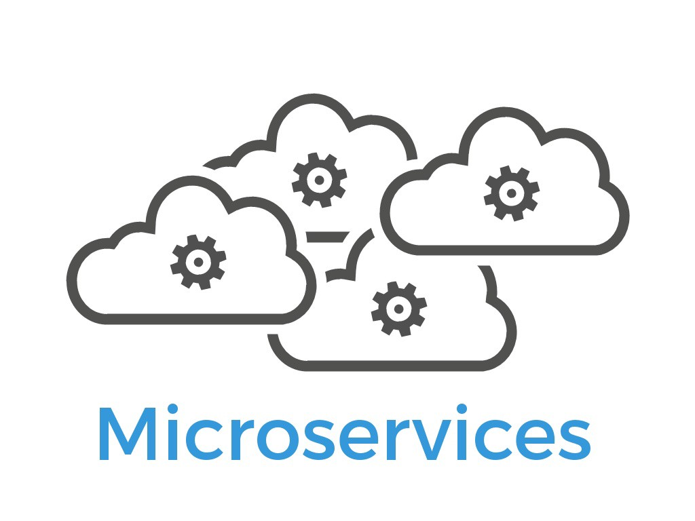
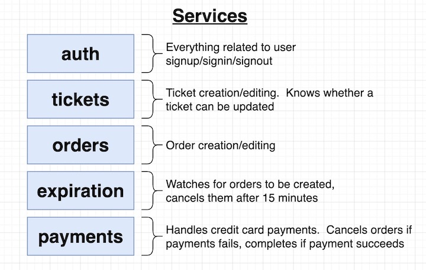
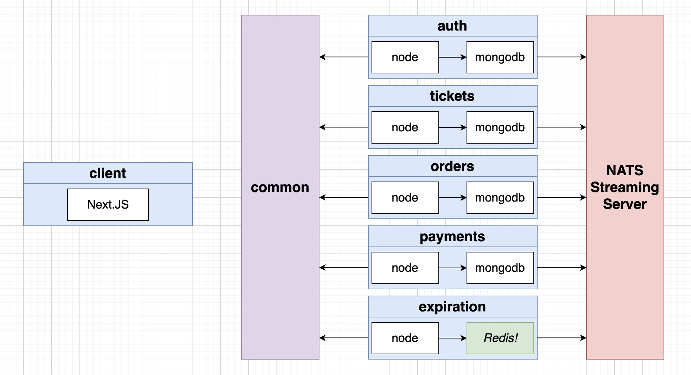

<!-- PROJECT SHIELDS -->
<!--
*** I'm using markdown "reference style" links for readability.
*** Reference links are enclosed in brackets [ ] instead of parentheses ( ).
*** See the bottom of this document for the declaration of the reference variables
*** for contributors-url, forks-url, etc. This is an optional, concise syntax you may use.
*** https://www.markdownguide.org/basic-syntax/#reference-style-links
-->
[![MIT License][license-shield]][license-url]
[![LinkedIn][linkedin-shield]][linkedin-url]


<!-- PROJECT LOGO -->
<br />
<p align="center">
  

  <h3 align="center">E-Commerce App(Microservices)</h3>

  <p align="center">
    An multi-service app for reselling and exchanging tickets. 
    <br />
    <br />
    <br />
    <a href="">View Demo</a>
  </p>
</p>


<!-- TABLE OF CONTENTS -->
## Table of Contents

* [Description](#decription)
  * [Functionalities](#functionalities)
  * [Technologies](#technologies)
  * [Features](#features)
* [Challenges](#challenges)
* [Future plan](#plan)
* [Contributing](#contributing)
* [License](#license) 
* [Contact](#contact)
* [Acknowledgements](#acknowledgements)


<!-- ABOUT THE PROJECT -->
## Description

Microservices grow popular since it allows rapid, frequent and reliable delivery of large, complex application.
However, it also has some major issues around it. From challenges with data replication to confusing unordered event streams, every major challenge of building microservices is worth exploring. 

This project's intuition comes from a ticket selling website, Stubhub and implements part of its features based on microservice architechture. Beyond focusing on the basics of microservices, this program is also a full-stack development: from the frontend, assembling a React app using Hooks, to the backend, including database design and deployment strategies.


<br />
**Services**
<br />
  

<br />
**Events and Architecture Design**
<br />
  


### Functionality
Built a large, multi-services app for tickets exchange and resale. It provides services for buyers/resellers to register, buy tickets with credit cards, list and resell tickets.

### Technologies
This section lists any major frameworks/libraries/databases that I use to build the app. 
* [Docker](https://www.docker.com/)
* [Kubernetes](https://kubernetes.io/)
* [React](https://reactjs.org/)
* [Next.js](https://nextjs.org/)
* [Node.js](https://nodejs.org/en/)
* [Express](https://expressjs.com/)
* [MongoDB](https://www.mongodb.com/)
* [Redis](https://redis.io/)
* [Skaffold](https://skaffold.dev/)
* [NATS](https://docs.nats.io/legacy/stan/intro)

### Features
* Event-Based Architecture: event bus not need many router trips.
  * Communicate data between services using a lightning-fast event bus.
  * Document and enforce structure constraints on events shared across microservices.
  * Using a Load Balancer with the  Ingress-NGINX Controller on Google Cloud.
* Build a Server-Side Rendered React App to render data from microservices using Hooks and Next JS.
* Deploy a multi-service app to the cloud with Docker and Kubernetes.
  * run a development environment(run a k8s development cluster and develop on it) through a cloud provider.
  * Configure(deploy) and scale services using Kubernetes Deployments; Orchestrating collections of services with Kubernetes.
* Facilitate workflows using Skaffold in Kubernetes dev environment.
* Solve concurrency issues in a distributed systems environment.


## Challenges
**Concurrency issues**: may run into the same event service twice.

**Solution**:

add a transaction service that records all transactions along with a database that stores
all transactions. 

## Future Plan

This is an example of how to list things you need to use the software and how to install them.
* npm
```sh
npm install npm@latest -g
```


<!-- CONTRIBUTING -->
## Contributing

Contributions are what make the open source community such an amazing place to be learn, inspire, and create. Any contributions you make are **greatly appreciated**.

1. Fork the Project
2. Create your Feature Branch (`git checkout -b feature/AmazingFeature`)
3. Commit your Changes (`git commit -m 'Add some AmazingFeature'`)
4. Push to the Branch (`git push origin feature/AmazingFeature`)
5. Open a Pull Request


<!-- LICENSE -->
## License

Distributed under the MIT License. See `LICENSE` for more information.


<!-- CONTACT -->
## Contact

Your Name - [@your_twitter](https://twitter.com/your_username) - email@example.com

Project Link: [https://github.com/your_username/repo_name](https://github.com/your_username/repo_name)


<!-- ACKNOWLEDGEMENTS -->
## Acknowledgements
* [GitHub Emoji Cheat Sheet](https://www.webpagefx.com/tools/emoji-cheat-sheet)
* [Img Shields](https://shields.io)
* [Choose an Open Source License](https://choosealicense.com)
* [GitHub Pages](https://pages.github.com)
* [Animate.css](https://daneden.github.io/animate.css)
* [Loaders.css](https://connoratherton.com/loaders)
* [Slick Carousel](https://kenwheeler.github.io/slick)
* [Smooth Scroll](https://github.com/cferdinandi/smooth-scroll)
* [Sticky Kit](http://leafo.net/sticky-kit)
* [JVectorMap](http://jvectormap.com)
* [Font Awesome](https://fontawesome.com)


<!-- MARKDOWN LINKS & IMAGES -->
<!-- https://www.markdownguide.org/basic-syntax/#reference-style-links -->
[license-shield]: https://img.shields.io/github/license/othneildrew/Best-README-Template.svg?style=flat-square
[license-url]: https://github.com/othneildrew/Best-README-Template/blob/master/LICENSE.txt
[linkedin-shield]: https://img.shields.io/badge/-LinkedIn-black.svg?style=flat-square&logo=linkedin&colorB=555
[linkedin-url]: https://www.linkedin.com/in/siyingchencrystal/
[product-screenshot]: images/screenshot.png
