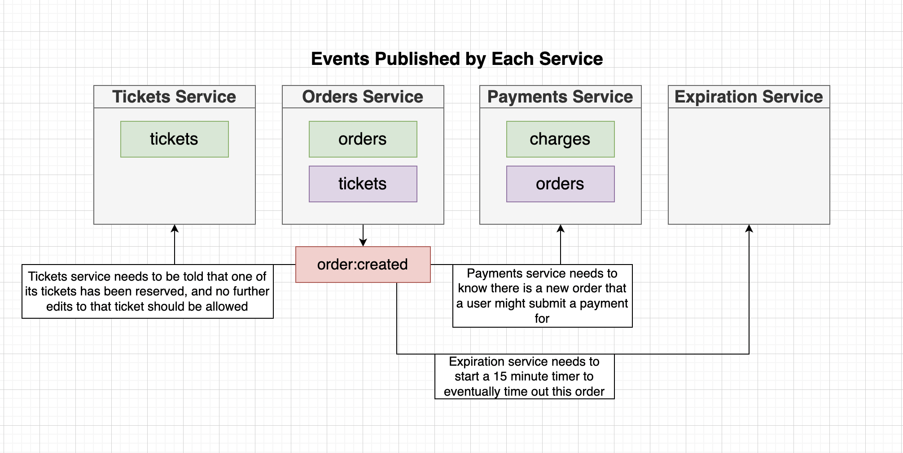

# Design(services and events)
* Services and their responsibility
  * auth	sign-up/in/out
  * tickets	Ticket creation/editing
  * orders	Order creation/editing
  * expiration	Watched for order to be created. Cancels them after 15 minutes
  * payments	Handles credit card payments. Cancels orders if payment fails, completes if payment succeeds.
  * NATS Streaming Server	"event bus"

    

* Events with Services

    

* Data with Services

    

## Auth Service
* Auth service route handler

    

* build a express-validator middleware with Express Validator to validate user data([reference-express-validator])

  * 1. set up validate rules([validation-rule]): username must be an email, password should be no empty
  * 2. validate request([validate-request]), if not valid throw an error

    

* Handling Errors
  * Goal: fix issues in:
    * output structured error messages
    * add various potential errors

  * Solution: 
    * Give erros a consistent structure by OOP design
    

      
    

    * Create an error handling middleware that will interpret errors of any type, then turn the error into an identically-structured response.
    

      
    

    * Usage:
      * In tickets, auth, order, payments services, app.js file claims to use this middleware
      * Any process throwing an error will be handled gracefully by this middleware

* Sign up workflow

  

* Use JWT to authenticate users for their follow-up requests
  * JWT payload contains user data encrypted with a JWT key(advantage over session: make server stateless)
  

    
  

* Subsequent authentication strategy
  * option 1: other service communicates with auth service either in sync or async way
  * option 2: each service hold authentication logic
  * result: choose option2 because we want other services can independently developed
  without relying on auth service.
  * implementation: Extract this part of auth logic into building a require-auth middleware[require-auth] with [current-user] middleware that decodes and parse payload information in the JWT to see whether the user is signed in.
  

    
  

  * require-auth and current-user logic:
  

    
  

  * MongoDB
    * define User model and store user data with Mongoose

## Build frontend with React and Next.js
* server side rendering
  

    
  

  

    
  

  
* implementation
  * how to handle a request
  

    
  

  
  * build a use request hook to send HTTP request to backend services
  

    
  

  * Next.js
    * Next.js is a popular and lightweight framework for static and server‑rendered applications built with React. It includes styling and routing solutions out of the box, and assumes that you’re using Node.js as the server environment.

    * app.js([app-js])
      * The code in App.js creates a component. In React, a component is a piece of reusable code that represents a part of a user interface. Components are used to render, manage, and update the UI elements in your application.

    * index.js([index-js])
      * the bridge between the component you created in the App.js file and the web browser. The browser looks for index.js and render it in HTML

    * pages
      * this module contains different pages that contains logic to interact with backend.
      * this page will automatically set as handling requests tthat end with the same path name as the file name.(if it's "signin", then the path would be "/signin")

    * pass props(currentuser, etc.) across components/pages
    

      
    

## Tickets Service
  

    
  

  * Generate ticket create and ticket update events, and notify order service
  
  * Use Nats Streaming Server to implement the event bus
    * Run the official 'nats-streaming' docker image in kubernetes.  Need to read the image's [docs]
    * To communicate with NATS, we will use a client library called **[node-nats-streaming]**([github-link])
    

      
    

    * NATS Streaming stores all events in memory (default), flat files or in a MySQL/Postgres DB
    * publisher and listener
    

      
    

## Design Events interaction between services
  * Goal: Deciding on what events to publish and what data they should contain; what other services should listen to this event
  * Rule #1 - Make one service in charge of all aspects of a Resource.  Emit events whenever changing that data
  * Rule #2 - If you don't know how the event will be used, publish all available data about the resource
  * Rule #3 - If you do know how the event will be consumed (and don't expect it to change soon), publish only the required info
  * Event design
    

      
    

    * Events published by Ticket service
    

      
    

    
    * Events published by Order service
      

        
      

      

        
      

    * Events published by Payment service
    

      
    

    * Events published by Expiration service
    

      
    

## Concurrency Issue
* For any similar application, even for those scaling to some scope, we cannot avoid concurrency issue. For example, there might have a race condition for buyer and seller, one of them want to buy this order and another updates the ticket at almost the same time.
    

      
    

* How to solve it?
  * Used optimistic concurrency control: Increment the 'version' number whenever the primary service responsible for a record emits an event to describe a create/update/destroy to a record
  * Solve concurrency issue by keeping an order of events
    

      
    

  * Implementation: used **mongoose-update-if-current** to assist in (1) automatically updating version number before data is saved (2) Customizes the find-and-update operation (save) to look for the correct version and update the version
    

      
    

  

## Expiration Service
* implementation: expiration service listens to order-created-events; when the event happens, it enqueues a job with Bull JS option(setting delay for the order expiration duration) and store it into Redis. It will dequeue after that duration of delay.
    

      
    

## Payment Service
* 
    

      
    

## CI/CD
[to-do]   

## About Test
* we use Jest to test and write our test set up codes and a set of test codes for each features inside each service module

  

<!-- MARKDOWN LINKS & IMAGES -->
[reference-express-validator]: https://dev.to/nedsoft/a-clean-approach-to-using-express-validator-8go
[validation-rule]: ticketing/auth/src/routes/signin.ts
[validate-request]: ticketing/common/src/middlewares/validate-request.ts
[require-auth]:ticketing/common/src/middlewares/require-auth.ts
[current-user]:ticketing/common/src/middlewares/current-user.ts
[app-js]: https://react.dev/learn/tutorial-tic-tac-toe
[index-js]: https://react.dev/learn/tutorial-tic-tac-toe
[node-nats-streaming]: https://www.npmjs.com/package/node-nats-streaming?activeTab=readme
[docs]: https://hub.docker.com/_/nats-streaming
[github-link]: https://github.com/nats-io/stan.js